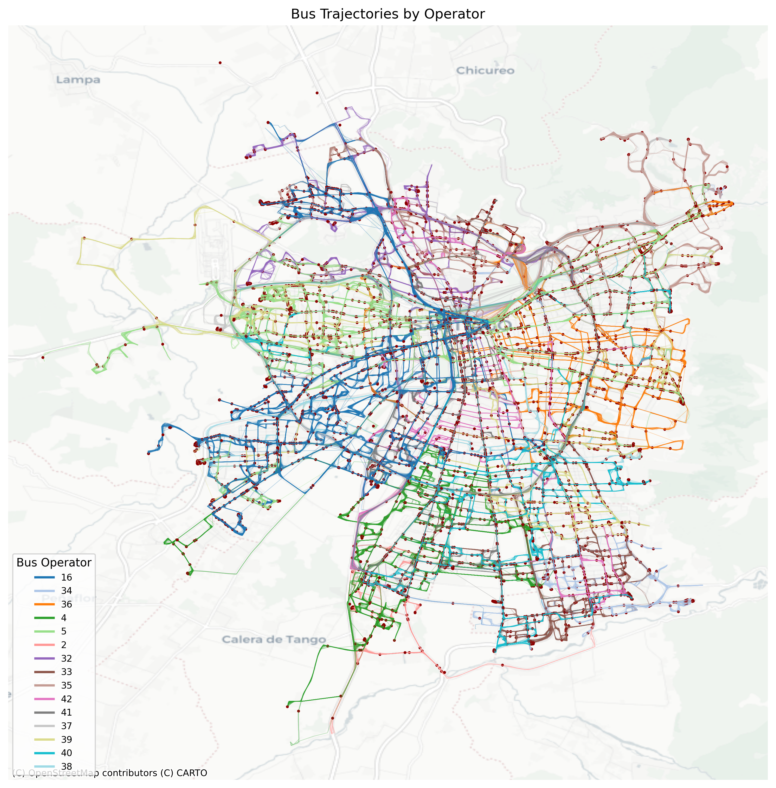
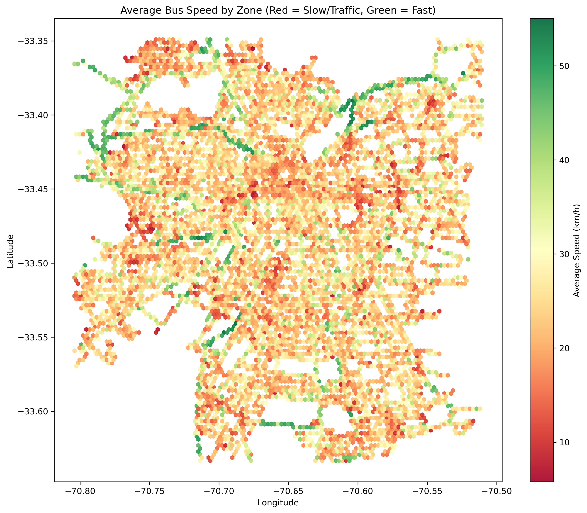

# Análisis de Datos de Transporte Público (Big Data)

**Demostración de uso de Google Cloud (Preparación Evaluación 2)**

> **Profesor:** Jorge Anais  
> **Asignatura:** Big Data

---

## Contexto

**Datos y servicios - Aplicaciones de predicción y planificación**

El Directorio de Transporte Público Metropolitano ha dispuesto un conjunto de datos y servicios para que puedan ser utilizados para la construcción de aplicaciones, estudios y análisis de información, entre otros.

A continuación se presenta una breve descripción de la información disponible:

* **Web Service de Posicionamiento:**
  Información sobre el posicionamiento de la flota completa de buses del sistema de transporte público de Santiago. Esta información se actualiza cada 1 minuto.
  *(Ejemplo para el web service de posicionamiento, Diccionario de servicios para el webservice de posicionamiento)*

* **Web Service de Alertas:**
  Información de las alertas operacionales generadas en el sistema de transporte.
  *(Ejemplo para el web service de alertas)*

* **Portal de datos abiertos:**
  Repositorio de acceso público de datos que podrán ser utilizados, entre otros fines, para la construcción de aplicaciones o análisis de información.

---

## Instrucciones de Laboratorio

> **Nota Importante:** Las instrucciones detalladas para realizar el laboratorio paso a paso se encuentran disponibles en formato PDF y Word dentro de la carpeta `instrucciones/`.

## Instrucciones para generar tu propio conjunto de datos (Opcional)

Adicionalmente, en este repositorio se incluye el código para colectar tu propio conjunto de datos. Esto no es necesario para desarrollar el laboratorio indicado anteriormente. Los scripts involucrados para la recolección de datos son los siguientes:

1. **Recolección de Datos:** El script `bus_data_collector.py` genera archivos particionados en formato Parquet (`data/buses_YYYY-MM-DD.parquet`) con información de coordenadas y velocidades.
2. **Exploración de Datos (EDA):** El cuaderno interactivo `resources/explore_buses_data.ipynb` permite analizar la distribución de velocidades, rutas y comportamiento de los operadores.
3. **Pipeline ETL (GCP):** El script `gcp/pipeline_buses.py` define un pipeline en Apache Beam para extraer los archivos Parquet desde Cloud Storage, transformarlos (limpieza y validación) y cargarlos en BigQuery.
4. **Visualización Espacial y Animación:** La carpeta `resources/` incluye scripts (`plot_trajectories.py`, `visualize_traffic.py`, `animate_buses.py`) para proyectar coordenadas GPS en mapas reales y generar animaciones temporales del movimiento.

### 1. Configuración del Entorno Python

Para aislar las dependencias del proyecto, se recomienda utilizar un entorno virtual:

1. Crea un entorno virtual:

   ```bash
   python -m venv venv
   ```

2. Activa el entorno virtual:
   * En Linux/macOS: `source venv/bin/activate`
   * En Windows: `venv\Scripts\activate`
3. Instala las dependencias necesarias:

   ```bash
   pip install -r requirements.txt
   ```

### 2. Descarga de Datos de Prueba

Dado el volumen de los archivos Parquet, estos se alojan externamente en Dropbox. Hemos preparado un script para automatizar su descarga.

Ejecuta el siguiente comando para descargar los archivos correspondientes a los días 08, 09 y 10 de mayo directamente en la carpeta `data/`:

```bash
python resources/download_data.py
```

*(Alternativa manual: Puedes descargar los archivos desde los siguientes enlaces y guardarlos en la carpeta `data/` con sus nombres originales)*

* *[Datos del 2026-05-08](https://www.dropbox.com/scl/fi/qn1g0s829dol4zu6p5gfh/buses_2026-05-08.parquet?rlkey=1q64fcvqrx6bkbzypqh0ywnro&st=rtfbkfzt&dl=0)*
* *[Datos del 2026-05-09](https://www.dropbox.com/scl/fi/wpebtr0gxkzulfv2xlqd0/buses_2026-05-09.parquet?rlkey=p4vnwwrhs5pwt0eovk4f0ebpe&st=19sjym4s&dl=0)*
* *[Datos del 2026-05-10](https://www.dropbox.com/scl/fi/jnqofxndeesqx2v1c7cua/buses_2026-05-10.parquet?rlkey=lt9ycse4o3i0hsqbxz8acqrnn&st=wbgoe6ty&dl=0)*

### 3. Recolección de Datos en Tiempo Real

Si deseas extraer nuevos datos en tiempo real desde el servicio de posicionamiento, tienes dos opciones:

**Opción A — Ejecución directa con Python:**

```bash
python resources/bus_data_collector.py
```

**Opción B — Servicio continuo con Docker (recomendado para Raspberry Pi):**

Ver la sección [Despliegue continuo con Docker](#despliegue-continuo-con-docker) para un servicio que corre indefinidamente, se reinicia automáticamente al boot, y persiste los datos en el host.

---

## Despliegue Continuo con Docker

El recolector puede desplegarse como un servicio persistente usando Docker Compose. Esta configuración está optimizada para Raspberry Pi 5 (aarch64).

### Características del stack

| Característica | Detalle |
|---|---|
| Imagen base | `python:3.11-slim` (multi-arch, nativo en aarch64) |
| Dependencias | Solo `pandas`, `requests`, `pyarrow` — sin libs de visualización |
| Servicio continuo | `while True` loop — no termina, reinicia ciclos cada `TOTAL_HOURS` |
| Persistencia | Volumen `./data:/app/data` — los `.parquet` sobreviven a recreaciones del contenedor |
| Auto-reinicio | `restart: unless-stopped` — se levanta solo si el host se reinicia |
| Log rotation | `max-size: 10m`, `max-file: 3` — no llena la SD |
| Seguridad | Usuario no-root (`collector`) dentro del contenedor |

### Parámetros configurables

Todos los parámetros del script pueden sobreescribirse con variables de entorno. Copia `env.example` como `.env` y ajusta:

| Variable | Default | Descripción |
|---|---|---|
| `CAPTURE_INTERVAL_SEC` | `60` | Segundos entre capturas |
| `TOTAL_HOURS` | `240` | Horas por ciclo interno (al terminar, empieza otro ciclo) |
| `FLUSH_EVERY` | `10` | Cada cuántas capturas exitosas se escribe a disco |
| `REQUEST_TIMEOUT_SEC` | `20` | Timeout de la request HTTP en segundos |

### Despliegue

```bash
cd ~/code/bigdata_demo_ev2
cp .env.example .env          # opcional, ajusta si quieres
docker compose up -d --build
```

### Verificar

```bash
docker compose ps
docker compose logs -f bus-collector
```

### Auto-reinicio al boot

Asegúrate de que Docker Engine inicie con el sistema:

```bash
sudo systemctl is-enabled docker
# si dice "disabled":
sudo systemctl enable docker
```

Con `restart: unless-stopped`, al reiniciar la Raspberry Pi Docker arranca automáticamente y el contenedor se reinicia solo, continuando la recolección desde donde quedó (los datos ya recolectados no se pierden, el script siempre hace append a los Parquet existentes).

---

## Visualizaciones Destacadas

### 1. Trayectorias de Buses por Operador

Muestra el trazado de los recorridos coloreados según la empresa operadora. Filtra coordenadas inválidas y utiliza proyección Web Mercator sobre un mapa base de OpenStreetMap.



### 2. Zonas de Congestión (Hexbin Map)

Agrupa los registros GPS en polígonos hexagonales para identificar visualmente las áreas geográficas con menor velocidad promedio de circulación.



### 3. Animación de Flota

Animación temporal (timelapse) del recorrido de los buses sobre el mapa, permitiendo observar la dinámica del transporte a lo largo del tiempo.


---

## Referencias

* <https://velocidades.seguimos.cl/>
* <https://x.com/arieIIopez/status/2043885675577999427>
* <https://www.dtpm.cl/index.php/homepage/sistema-de-transportes/datos-y-servicios>
