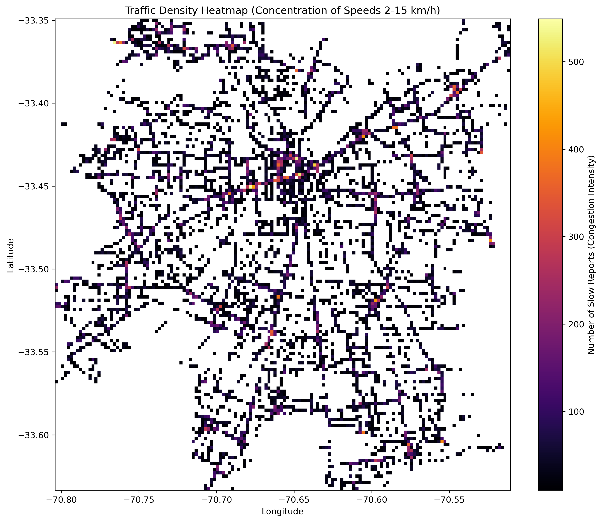

# bigdata_demo_ev2

Demostración de como utilizar GC (Preparación Evaluación 2)

> Profesor Jorge Anais  
> Big Data

## Contexto

## Instrucciones

### Configuración del Entorno Python

1. Crea un entorno virtual:
   ```bash
   python -m venv venv
   ```
2. Activa el entorno virtual:
   - En Linux/Mac: `source venv/bin/activate`
   - En Windows: `venv\Scripts\activate`
3. Instala las dependencias necesarias:
   ```bash
   pip install -r requirements.txt
   ```
4. Ejecuta el recolector de datos:
   ```bash
   python resources/bus_data_collector.py
   ```

## Resultados esperados

1. **Datos Recolectados**: El script `bus_data_collector.py` generará un archivo Parquet (ej. `data/buses_YYYY-MM-DD.parquet`) que almacena de forma particionada la información de coordenadas y velocidades de los buses.
2. **Exploración de Datos (EDA)**: Se incluye un cuaderno interactivo (`explore_buses_data.ipynb`) que analiza la distribución de velocidades, rutas y operadores.
3. **Scripts de Visualización Espacial**: En la carpeta `resources/` se incluyeron scripts (`plot_trajectories.py`, `visualize_traffic.py`) que permiten proyectar coordenadas GPS en mapas reales.

## Visualizaciones

### 1. Trayectorias de Buses por Operador
Muestra el trazado de los buses coloreados por el operador del servicio, eliminando coordenadas inválidas y usando Web Mercator para sobreponer los datos en un mapa callejero (OpenStreetMap).


### 2. Zonas de Congestión (Velocidad Promedio Hexbin)
Este mapa agrupa los registros GPS en hexágonos para visualizar las zonas geográficas con menores velocidades promedio.


### 3. Mapa de Densidad de Tráfico Lento (KDE)
Un mapa de calor (Kernel Density Estimation) que señala la densidad geográfica de registros donde la velocidad de los buses fue inferior a 15 km/h.


